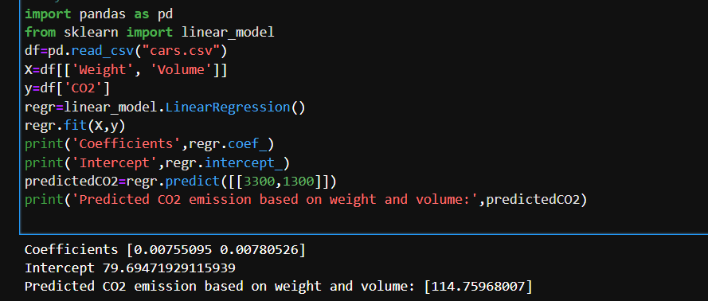

# Implementation of Multivariate Linear Regression
## Aim
To write a python program to implement multivariate linear regression and predict the output.
## Equipment’s required:
1.	Hardware – PCs
2.	Anaconda – Python 3.7 Installation / Moodle-Code Runner
## Algorithm:
### Step1
Import pandas

### Step2
Import linear_model


### Step3
Read the csv file


### Step4
Enter the parameters to implement

### Step5
Run the program and predict the output

## Program:
```
import pandas as pd
from sklearn import linear_model
df=pd.read_csv("cars.csv")
X=df[['Weight', 'Volume']]
y=df['CO2']
regr=linear_model.LinearRegression()
regr.fit(X,y)
print('Coefficients',regr.coef_)
print('Intercept',regr.intercept_)
predictedCO2=regr.predict([[3300,1300]])
print('Predicted CO2 emission based on weight and volume:',predictedCO2)


```
## Output:


### Insert your output

<br>

## Result
Thus the multivariate linear regression is implemented and predicted the output using python program.